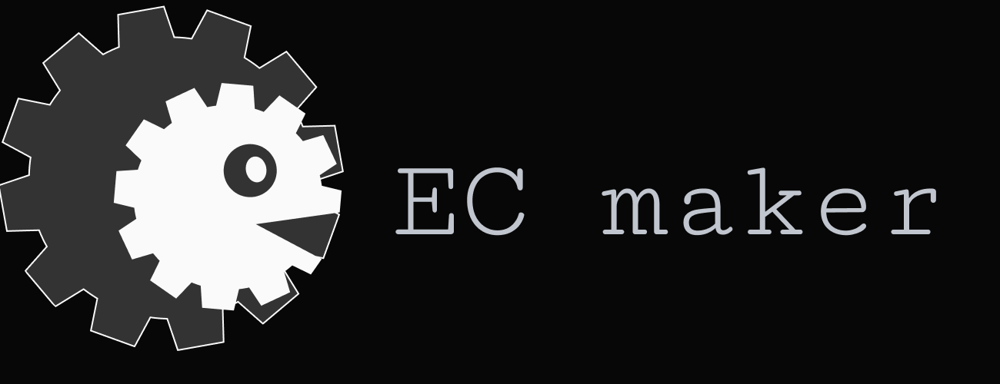

# ECmaker blog

This is the homepage and blog for the ECmaker community.
コミュニティECmaker のホームページ件ブログです。

Home: https://blog.ec-maker.com/

## Special Thanks
This blog is based on Knob's noblog and has been modified and added to.  
Thank you for providing the source code for this wonderful blog.

このブログはKnob様のnoblogを元に流用・追加作成しています。  
素敵なブログのソースコードをご提供いただきありがとうございます。

[Read More](https://blog.ec-maker.com/posts/notion-blog_getting-started)

## Features
- Next.jsを使用した Notion Blog.
- Notion DatabaseをBlogの記事として表示
- 目次機能
- いいね・コメント機能
- Google Analytics

## Future Plans
Please see the [issues](https://github.com/ECMaker/blog/issues).

## Used
Notion, Next.js, TypeSclipt, TailwindCSS, Netlify...
- [Next.js](https://nextjs.org/)
- [Notion](https://www.notion.so/)
- [Notion API](https://developers.notion.com/)
- [TypeScript](https://www.typescriptlang.org/)
- [Tailwind CSS](https://tailwindcss.com/)
- [Netlify](https://www.netlify.com/)
- [Mantine](https://mantine.dev/)
- [ESLint](https://eslint.org/)
- [Prettier](https://prettier.io/)
- [Husky](https://typicode.github.io/husky/#/)
- [Storybook](https://storybook.js.org/)
- [React Icons](https://react-icons.github.io/react-icons/)
- [Recoil](https://recoiljs.org/)
- [tiptap](https://tiptap.dev/)
- [next-seo](https://github.com/garmeeh/next-seo)
- [Algolia](https://www.algolia.com/)
- [github-contributions-api](https://github.com/kawarimidoll/deno-github-contributions-api)

## License
This project is licensed under the MIT License.  
このサイトのソースコードはポートフォリオも兼ねてGitHub上で公開しています。  
notion-blogで開発されている方はご自由に参照ください。  
コメントをいただけると励みになります | [NotionBlogをはじめる](https://blog.ec-maker.com/posts/notion-blog_getting-started) |

